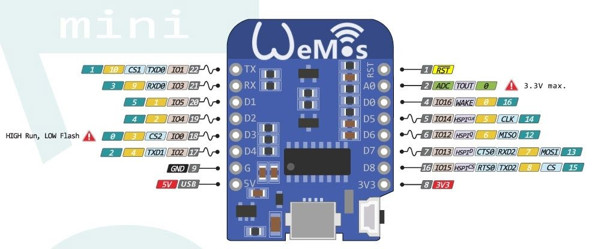
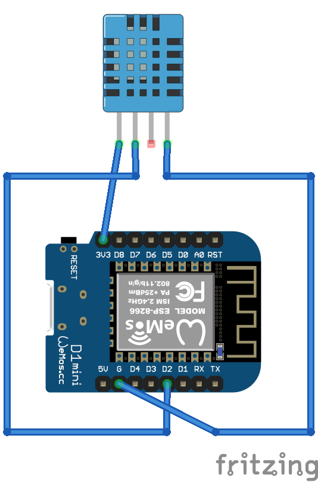
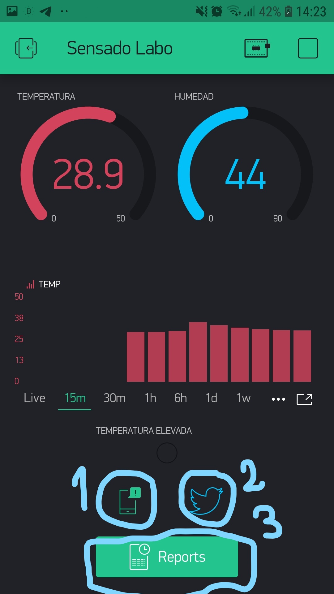
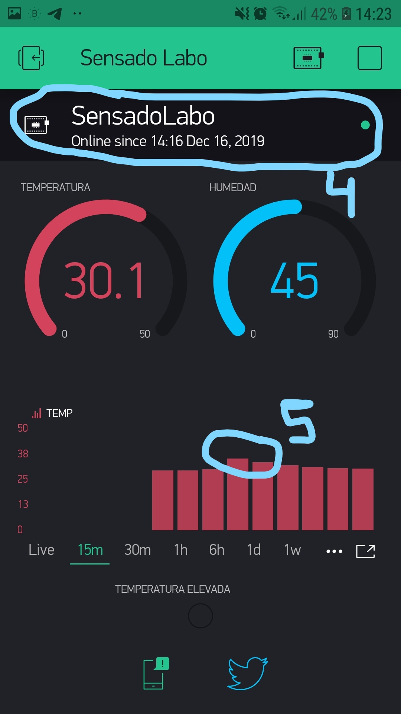
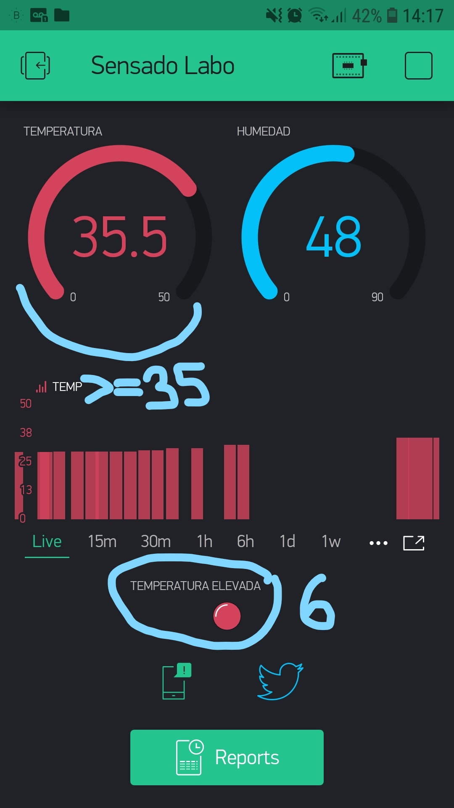
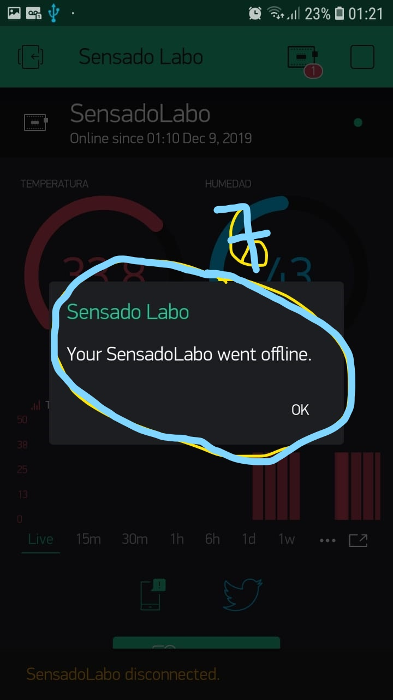

# Proyecto Sensado_ESP8266_DHT11
Sistema de Control de sensado de temperatura y humedad con una placa ESP8266 y un sensor DHT11

<br>

## Índice 📜

<details>
 <summary> Ver </summary>
 
 <br>
 
### Sección 1) Descripción, Tecnologías y Referencias

 - [1.0) Descripción del Proyecto.](#10-descripción-)
    - [1.0.0) Objetivos y Finalidad.](#100-objetivos-y-finalidad)
    - [1.0.1) Introducción.](#101-introducción)
    - [1.0.2) Hardware.](#102-hardware)
    - [1.0.3) Software.](#103-software)
    - [1.0.4) Resultados y errores.](#104-resultados-y-errores)
    - [1.0.5) F.O.D.A](#105-foda)
    - [1.0.6) Conclusiones](#106-conclusiones)
 - [1.1) Ejecución del Proyecto.](#11-ejecución-del-proyecto-)
 - [1.2) Configurar un proyecto serverless desde cero](#12-configurar-un-proyecto-serverless-desde-cero-)
 - [1.3) Tecnologías.](#13-tecnologías-)
 - [1.4) Referencias.](#14-referencias-)

<br>

</details>


<br>

## Sección 1) Descripción, Tecnologías y Dependencias 


### 1.0) Descripción [🔝](#índice-) 

### 1.0.0) Objetivos y Finalidad

<details>
  <summary>Ver</summary>
 
 <br>

 El propósito de este proyecto es la inclusión tecnológica por parte del personal que se desempeña en el sector de salud, específicamente en laboratorios. Como así también aumentar el sistema de medición y control en logística.
La motivación surgió en base a implementar algún sistema que nos permita tener una cómoda medición de rangos de temperatura y humedad sin tener que preocuparnos constantemente sobre el aparato del laboratorio, darles prioridad a otras tareas, agilizar tiempos y tener un mejor control sobre el mismo.
El destinatario del proyecto será el personal que se implemente en el área de salud, puntualmente en el sector descrito previamente
La funcionalidad del proyecto es a un bajo costo de inversión, una implementación de un punto de sensado de temperatura y humedad controlado de forma automática y remota. El personal del sector podrá hacer uso de este sistema de sensado mediante una aplicación móvil, el uso de la misma es descrita en este informe.
Las metodologías para el funcionamiento del dispositivo son:

* Creación y estructuración del código del dispositivo de censado (Wemos d1 esp8266).

* Descarga y configuración de la aplicación Blynk.

* Diseño, implementación y configuración de plantilla de la app.

* Puesta a prueba del dispositivo y aplicación.


<br>

</details>


### 1.0.1) Introducción

<details>
  <summary>Ver</summary>
 
 <br>

 Mediante el surgimiento de la necesidad de tener un control en un ambiente de trabajo se planteó la posibilidad de realizar un punto de censado 
de temperatura y humedad en un ambiente no controlado de forma automática por parte del personal, incorporando la capacidad tecnológica a un bajo costo y una inversión de control y seguridad más apropiada. La problemática se presenta a nivel general en la inversión de automatismos en el sector productivo, salud, etc.
y la poca inversión de formación del personal en cuanto a tecnología concierne. Por eso con el proyecto presentado se implementa no solo un automatismo electrónico sino también la inclusión tecnológica del personal a este de forma que la interacción sea directa por el mismo.

En la etapa inicial del proyecto se realizo el conexionado del sistema electrónico a implementar y el diseño de software que este precisaba.
	En la segunda etapa del proyecto se confecciono el entorno de desarrollo (ide: arduino), mediante el cual se realizará y armara el programa principal de la placa ESP8266(núcleo lógico del proyecto), además de la confección del ide se implementaron las librerías necesarias para el funcionamiento del mismo junto con el sensor de temperatura y humedad (DHT11) y la app móvil de uso.
	La tercera etapa consistió en el desarrollo del programa que implementa el ESP8266 y el diseño de plantilla de la aplicación Blynk


<br>

</details>


### 1.0.2) Hardware

<details>
  <summary>Ver</summary>
 
 <br>



#### Características técnicas del Wemos d1 mini ESP8266:

* Velocidad: 80MHz/160MHz
* Flash: 4M bytes
* Tensión funcionamiento: 3.3V
* Entradas y salidas digitales: 11, todos (salvo el D0) con PWM, interrupciones, e I2C
* Entradas analógicas: 1 (Max. 3.2V)
* Conector Micro-USB.

#### Características técnicas del sensor DHT11:

* Alimentación: 3Vdc ≤ Vcc ≤ 5Vdc
* Rango de medición de temperatura: 0 a 50 °C
* Precisión de medición de temperatura: ±2.0 °C.
* Resolución Temperatura: 0.1°C
* Rango de medición de humedad: 20% a 90% RH.
* Precisión de medición de humedad: 4% RH.
* Resolución Humedad: 1% RH
* Tiempo de censado: 1 seg.


<br>

</details>


### 1.0.3) Software

<details>
  <summary>Ver</summary>
 
 <br>


#### Consideraciones Diagrama Plantilla SensadoLabo BLYNK:



1) Cuando el ESP8266 pierda conexión nos notificara mediante una alerta a nuestro teléfono (previamente configurado tanto el número y los permisos del mismo).
2) Nos notificara a nuestra cuenta de Twitter en caso de que haya algún problema.
3) Podremos Generar los reportes diarios, semanales, mensuales a cerca de los valores obtenidos de humedad y temperatura.



4) En caso de que nuestras alertas fallaran tenemos una interfaz de información acerca de la conexión de nuestro dispositivo IOT.
5) En caso de que nuestras alertas fallen, tendremos una interfaz de información acerca de la conexión de nuestro dispositivo IOT.




6) Se puede observar la variación de Temperatura en el gráfico, está configurado para un máximo de 50°.




7) Cuando se supere el umbral de temperatura establecido se producirán destellos de un led a modo de advertencia.


#### Driver
* [IDE Arduino](https://docs.arduino.cc/software/ide-v1/tutorials/Windows)
* [Driver Puerto Serial Esp](http://www.wch.cn/download/CH341SER_EXE.html)

#### Librerías
* [SPI.h](https://docs.arduino.cc/learn/communication/spi)
* [ESP8266WiFi.h](https://github.com/esp8266/Arduino)
* [BlynkSimpleEsp8266.h](https://github.com/blynkkk/blynk-library)
* [SimpleTimer.h](https://github.com/jfturcot/SimpleTimer)
* [DHT.h](https://github.com/adafruit/DHT-sensor-library)

#### Funciones Externas
* Serial.begin()
* Blynk.begin()
* dht.readHumidity()
* dht.readTemperature()
* Blynk.virtualWrite()
* timer.setInterval()
* Blynk.run()
* timer.run()


#### Otros
- https://www.arduino.cc/
- https://blynk.io/
- https://fritzing.org/download/


<br>

</details>


### 1.0.4) Resultados y errores

<details>
  <summary>Ver</summary>
 
 <br>

Se reemplazo el dispositivo principal (Arduino uno), por un ESP8266 WEmos d1, ya que este tiene la capacidad de un reducido costo
en relación al primero y la comunicación directa a internet mediante una placa wifi(sin módulos externos), por ende se creó un programa para el ESP8266 utilizando el ide Arduino y las configuraciones que este precise(path, librerias, funciones,etc).Se implementaron librerias adicionales para la comunicación de la aplicación BLYNK mediante funciones de la mismas(detalle en apartado), se cambió la configuración del dispotivivo vía hardware y software, ya que al principio se utilizó un sensor de temperatura dht22 y otro tipo sonda, puesta a prueba correcta de la misma.


<br>

</details>


### 1.0.5) F.O.D.A

<details>
  <summary>Ver</summary>
 
 <br>


| Fortalezas | Oportunidades | Debilidades | Amenazas |
| ------------- | ------------- | ------------- | ------------- |
| Fácil implementación y uso |  Bajo Costo y Proyecto Open Source | Conocimiento en Programación y Electrónica |  Inconvenientes en el uso de drivers y librerías para el ESP8266 |

<br>

</details>


### 1.0.6) Conclusiones

<details>
  <summary>Ver</summary>
 
 <br>


El proyecto incentivo a la aproximación del uso de sistemas IOT (internet de las cosas) para automatizar tareas, no solo en el área propiamente a implementar sino en cualquier área. La electrónica y la informática evoluciona a pasos cada vez mas grandes, y desaprovechar esta situación nos lleva a gastos que pueden ser innecesarios o distribuciones de roles que son redundantes en ciertos aspectos. Este proyecto con un simple sensor de temperatura, una placa de control gestionada por un programa y conexión wifi, nos permite la comodidad de la gestión de dos magnitudes (humedad y temperatura) de forma remota sin la necesidad de que el personal este recorriendo la maquinaria implementada en el sector.

<br>

</details>


### 1.1) Ejecución del Proyecto [🔝](#índice-)

<details>
  <summary>Ver</summary>
 
 
* Una vez creado un entorno de trabajo a través de algún ide, clonamos el proyecto
```git
git clone https://github.com/andresWeitzel/Sensado_ESP8266_DHT11
```
* Nos posicionamos sobre el proyecto
```git
cd 'projectName'
```
* Instalamos todas las librerías necesarias del proyecto desde el IDE de arduino
```git
#include <SPI.h>;
#include <ESP8266WiFi.h>;
#include <BlynkSimpleEsp8266.h>;
#include <SimpleTimer.h>;
#include <DHT.h>;
```
* Modificamos el auth generado desde BLYNK
```git
char auth[] = "_kc9BxuBX9RZHGFAk0TaZ59IT66TAdy1";
```
* Agregamos los valores correspondientes de nuestra red wifi
```git
char ssid[] = "xx";//nombre
char pass[] = "xx";//password
```
* Añadimos un email para comprobar el punto de control de temperatura máxima
```git
Blynk.email("xx@hotmail.com","AVISO!!", "Se supero la temperatura maxima!!.");
```
* Nos conectamos desde BLYNK con la app. Escanear qr
* App: https://play.google.com/store/apps/details?id=cc.blynk&hl=pt
* Comprobamos que se reciban correctamente los datos.
 
<br>

</details>
